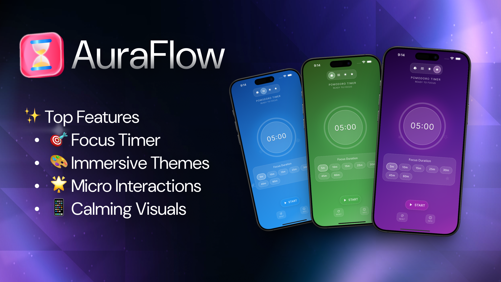

# AuraFlow - Focus Timer



**Unwind and boost your productivity with AuraFlow, a beautifully crafted focus timer app featuring immersive, calming visuals and delightful micro-interactions to guide you to mindful work.**

## ✨ Features

### 🎯 Focus Timer (Pomodoro Technique)

- **Customizable Duration**: Choose from preset times (5, 10, 15, 25, 30, 45, 60 minutes)
- **Visual Progress**: Circular progress indicator with smooth animations
- **Session Controls**: Start, pause, and reset functionality
- **Completion Notifications**: Celebrate your focus achievements

### 🎨 Immersive Themes

- **Forest Theme**: Deep greens with nature-inspired ambiance
- **Ocean Theme**: Calming blues with wave-like animations
- **Sunset Theme**: Warm oranges and purples for evening sessions
- **Galaxy Theme**: Mystical purples and cosmic vibes

### 🌟 Visual Experience

- **Gradient Backgrounds**: Dynamic, theme-based gradients
- **Breathing Animations**: Gentle pulsing effects during focus sessions
- **Ambient Icons**: Floating thematic elements (trees, waves, stars)
- **Smooth Transitions**: Fluid animations throughout the app

### 📱 User Experience

- **One-Screen Design**: Everything fits without scrolling
- **Responsive Layout**: Adapts to different screen sizes
- **Touch-Friendly**: Intuitive controls and interactions
- **Settings Persistence**: Remembers your preferences

## 🚀 Getting Started

### Prerequisites

- Flutter SDK ^3.6.0
- Dart SDK
- iOS 12.0+ / Android API 21+

### Installation

1. **Clone the repository**

   ```bash
   git clone https://github.com/ItisSubham/AuraFlow.git
   cd AuraFlow
   ```

2. **Install dependencies**

   ```bash
   flutter pub get
   ```

3. **Run the app**
   ```bash
   flutter run
   ```

### Building for Production

**Android:**

```bash
flutter build apk --release
```

**iOS:**

```bash
flutter build ios --release
```

## 📁 Project Structure

```
lib/
├── main.dart                 # App entry point
├── theme.dart               # App-wide theme configuration
├── models/
│   └── timer_theme.dart     # Theme data models
├── screens/
│   └── focus_timer_screen.dart  # Main timer screen
└── widgets/
    ├── ambient_icons.dart   # Floating ambient animations
    ├── breathing_timer.dart # Main timer with progress ring
    ├── control_buttons.dart # Start/pause/reset controls
    ├── gradient_background.dart # Dynamic backgrounds
    ├── theme_selector.dart  # Theme switching controls
    └── time_selector.dart   # Duration selection widget
```

## 🎨 Themes

| Theme      | Colors                     | Ambiance              |
| ---------- | -------------------------- | --------------------- |
| **Forest** | Deep greens, earth tones   | Trees, nature sounds  |
| **Ocean**  | Blues, teals, aqua         | Waves, water elements |
| **Sunset** | Oranges, purples, magentas | Sun, warm glow        |
| **Galaxy** | Deep purples, cosmic blues | Stars, space elements |

## 🛠️ Dependencies

- [`flutter`](https://flutter.dev/) - UI framework
- [`google_fonts`](https://pub.dev/packages/google_fonts) - Typography
- [`shared_preferences`](https://pub.dev/packages/shared_preferences) - Local storage
- [`cupertino_icons`](https://pub.dev/packages/cupertino_icons) - iOS-style icons

## 🎯 Usage

1. **Select Theme**: Tap theme icons at the top to change ambiance
2. **Set Duration**: Choose your focus time from preset options
3. **Start Session**: Hit the START button to begin your focus session
4. **Stay Focused**: Watch the breathing animation and progress ring
5. **Complete**: Celebrate when your session ends!

## 🔧 Customization

### Adding New Themes

1. Add new theme to `TimerThemeType` enum in `models/timer_theme.dart`
2. Define theme colors and icon in the `themes` map
3. Add corresponding ambient icons in `ambient_icons.dart`

### Modifying Timer Durations

Edit the `_presetTimes` list in `widgets/time_selector.dart`:

```dart
static const List<int> _presetTimes = [5, 10, 15, 25, 30, 45, 60];
```

## 🤝 Contributing

1. Fork the repository
2. Create a feature branch (`git checkout -b feature/amazing-feature`)
3. Commit your changes (`git commit -m 'Add amazing feature'`)
4. Push to the branch (`git push origin feature/amazing-feature`)
5. Open a Pull Request

## 📝 License

This project is licensed under the MIT License - see the [LICENSE](LICENSE) file for details.

## 🙏 Acknowledgments

- Inspired by the Pomodoro Technique by Francesco Cirillo
- Design influenced by modern mindfulness and productivity apps
- Built with ❤️ using Flutter

## 🐛 Known Issues

- None currently reported

## 🗺️ Roadmap

- [ ] Sound effects and ambient sounds
- [ ] Statistics and analytics
- [ ] Custom timer durations
- [ ] Break timer functionality
- [ ] Dark mode improvements
- [ ] Widget support

## 📞 Support

If you encounter any issues or have suggestions, please [open an issue](https://github.com/ItisSubham/AuraFlow/issues).

---

**Made with 💚 for focused minds everywhere**
